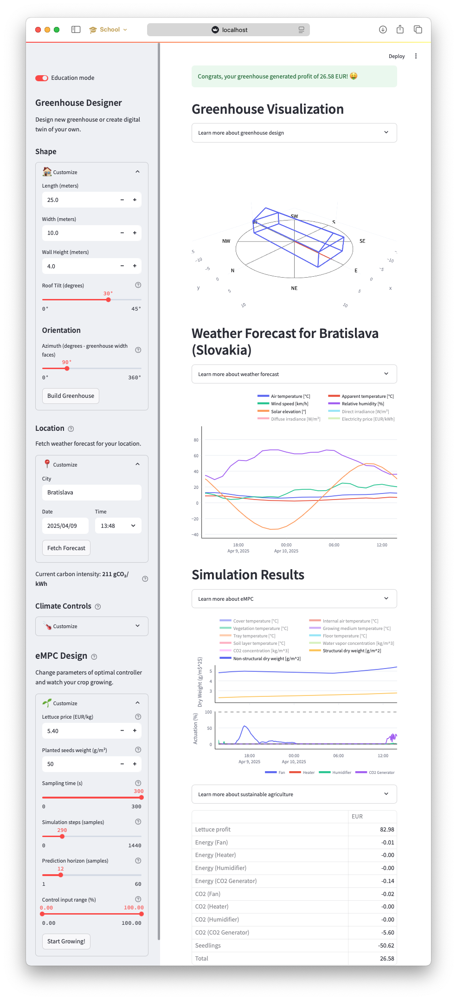

# 🌱 EcoMPC4Greenhouse: Education Platform

[](http://ecompc4greenhouse.streamlit.app)
[](https://github.com/MarekWadinger/ecompc-greenhouse-platform/actions/workflows/python-app.yml)
[](https://github.com/astral-sh/ruff)
[](https://codecov.io/gh/MarekWadinger/ecompc-greenhouse-platform)

[](http://ecompc4greenhouse.streamlit.app)

## 🌍 Overview

**EcoMPC4Greenhouse** is an interactive, web-based platform aimed at enhancing education in Nonlinear Economic Model Predictive Control (NEMPC) applied to greenhouse climate management. By integrating real-time data and dynamic simulations, the platform enables students and researchers to explore how to optimize greenhouse systems for sustainability, balancing plant growth, energy use, and CO₂ emissions.

Developed to support the publication *"Carbon Neutral Greenhouse: Economic Model Predictive Control Framework for Education,"* the platform provides hands-on learning with advanced control techniques, bridging theory and practical agricultural applications.

## 🚀 Features

- **Greenhouse Climate Model**: Simulates lettuce growth dynamics influenced by external weather data, temperature, light, and CO₂ concentration.
- **Economic MPC Framework**: Optimizes climate conditions to balance crop yield, energy consumption, and CO₂ emissions.
- **Real-Time Data Integration**: Fetches **[🌦️ weather forecast](https://open-meteo.com)**, **[😶‍🌫️ carbon intensity forecasts](https://api.electricitymap.org)** and **[⚡️ electricity price](https://newtransparency.entsoe.eu/)** to adjust the greenhouse control strategy.
- **User-Friendly Interface**: Intuitive design for students to visualize simulations, analyze results, and experiment with control parameters.
- **Educational Focus**: Aimed at bridging the gap between control theory and real-world applications, enhancing problem-solving skills through interactive learning.

## 📜 Citation

If you use this platform for academic purposes, please cite our publication:

```bibtex
@misc{Wadinger2024,
  author = {Wadinger, Marek and F'aber, Rastislav and Pavlovi\v cov'a, Erika and Paulen, Radoslav},
  note   = {Submitted to European Control Conference (ECC)},
  title  = {Carbon Neutral Greenhouse: Economic Model Predictive Control Framework for Education},
  url    = {},
  year   = {2025},
}
```

## 👐 Contributing

Feel free to contribute in any way you like, we're always open to new ideas and
approaches.

- Feel welcome to
[open an issue](https://github.com/MarekWadinger/ecompc-greenhouse-platform/issues/new/choose)
if you think you've spotted a bug or a performance issue.

Please check out the [contribution guidelines](CONTRIBUTING.md)
if you want to bring modifications to the code base.

## 🛠 For Developers

### Installation (for Local Use)

If you wish to run the platform locally, follow the steps below:

1. Clone the repository:

    ```sh
    git clone https://github.com/MarekWadinger/ecompc-greenhouse-platform.git
    ```

2. Navigate to the project folder:

    ```sh
    cd ecompc-greenhouse-platform
    ```

3. Create a virtual environment:

    ```sh
    python -m venv --upgrade-deps .venv
    source .venv/bin/activate
    ```

4. Install the required dependencies:

    ```sh
    pip install -r requirements.txt
    ```

5. Run the platform locally:

    ```sh
    streamlit run app.py
    ```
